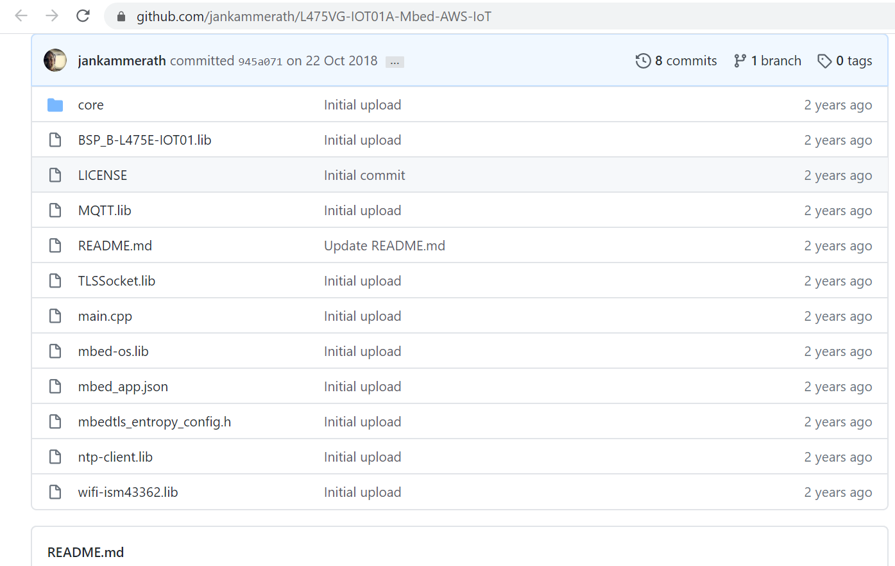

# Internet of Things (IoT)

## Introdução

Trabalhar com IoT traz consigo desafios complexos que dependem, entre outros fatores, da fonte limitada de energia dos dispositivos que compõem a rede que, por sua vez, pode afetar a disponibilidade do sistema como um todo. 

Ainda temos os desafios da interoperabilidade, da compatibilidade entre os sistemas e da mobilidade. Pesquisadores a todo momento buscam estratégias para mitigar os impactos causados pelos fatores citados acima a fim de tornar a IoT cada vez mais confiável para que sua utilização proporcione maior conforto, segurança e qualidade de vida para os cidadões. O assunto dentro SERPRO é tratado como projeto estratégico onde o avanço na maturidade desde tema é um dos objetivos do projeto.


## Objetivo
O objetivo desta página é descrever modelos arquiteturais de IoT, documentar experimentos, modelos de uso e etc.

## Contribuição
Quer contribuir? Abra uma issue, mande um PR para o projeto no [git](https://git.serpro/dedat/arquitetura/iot) ou, se preferir, envie uma mensagem no canal **#iot** do [chat.serpro.gov.br](https://chat.serpro.gov.br/channel/iot).

## Sumário

- [Conceitos](introduction.md)
- [IoT Mechanisms](iot_mechanisms.md)
- [IoT Solution Components](iot_solution_components.md)
- [Patterns](patterns.md)
- [Experimentos/Laboratórios](experimentos.md)
- [Plano de Capacitação (DevDev)](capacitacao.md)
- [Modelos de uso](modelos_uso.md)
- [Parcerias](parcerias.md)
- [Projetos](projetos.md)
- [Notícias](noticias.md)
- [Eventos](Eventos.md)
- [Equipes](equipes.md)


## Welcome to GitHub Pages

You can use the [editor on GitHub](https://github.com/profclaudiopereira/ArquiteturasdeProjetosIoT/edit/gh-pages/index.md) to maintain and preview the content for your website in Markdown files.

Whenever you commit to this repository, GitHub Pages will run [Jekyll](https://jekyllrb.com/) to rebuild the pages in your site, from the content in your Markdown files.

### Markdown

Markdown is a lightweight and easy-to-use syntax for styling your writing. It includes conventions for

```markdown
Syntax highlighted code block

# Header 1
## Header 2
### Header 3

- Bulleted
- List

1. Numbered
2. List

**Bold** and _Italic_ and `Code` text

[Link](url) and 


```

For more details see [GitHub Flavored Markdown](https://guides.github.com/features/mastering-markdown/).

### Jekyll Themes

Your Pages site will use the layout and styles from the Jekyll theme you have selected in your [repository settings](https://github.com/profclaudiopereira/ArquiteturasdeProjetosIoT/settings/pages). The name of this theme is saved in the Jekyll `_config.yml` configuration file.

### Support or Contact

Having trouble with Pages? Check out our [documentation](https://docs.github.com/categories/github-pages-basics/) or [contact support](https://support.github.com/contact) and we’ll help you sort it out.
